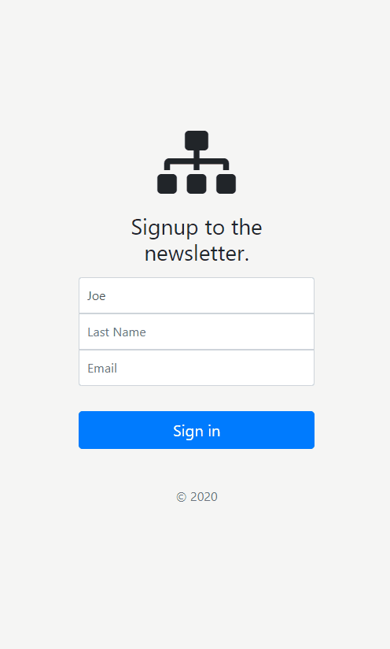

# newsletter-signup

> Creating a newsletter-signup project for Dr. Angela Yu's Udemy Course
___

### Table of Contents

- [Description](#description)
- [Usage](#usage)
- [Credits](#credits)

___
## Description

This project was created to help us learn APIs. In this particular case we are using MailChimp's API to create a newsletter signup page. This page will allow the user to input their name and e-mail address which will then be sent over to MailChimp for us take hold of that data.

### Issues

There are still issues with this project which will be dealt with promptly. As of 8/5/2020 I'm still documenting my projects. This is the first project that I will come back to and fix the errors that are presented. 

#### Technologies Used:
- HTML
- CSS
- <a href="https://code.visualstudio.com">VS Code</a>
- <a href="https://fonts.google.com/">google fonts</a>
- <a href="https://nodejs.org/en/">NodeJS</a>
- <a href="https://www.npmjs.com/">npm</a>
- <a href="https://www.npmjs.com/package/dotenv">dotenv</a>
- <a href="https://getbootstrap.com/">Bootstrap</a>
- <a href="https://dashboard.heroku.com/apps">Heroku</a>

___
## Usage

This project has no usage other than to present future employers of my progresss as a Full-Stack Web Developer.

___
## Credits
- Dr. Angela Yu
- Udemy